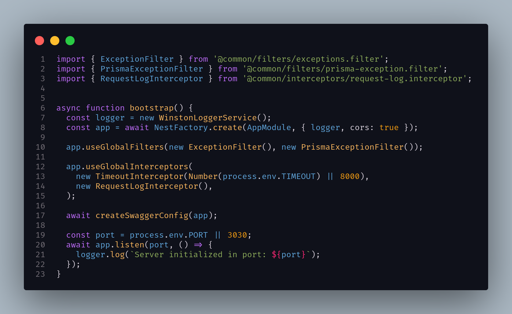
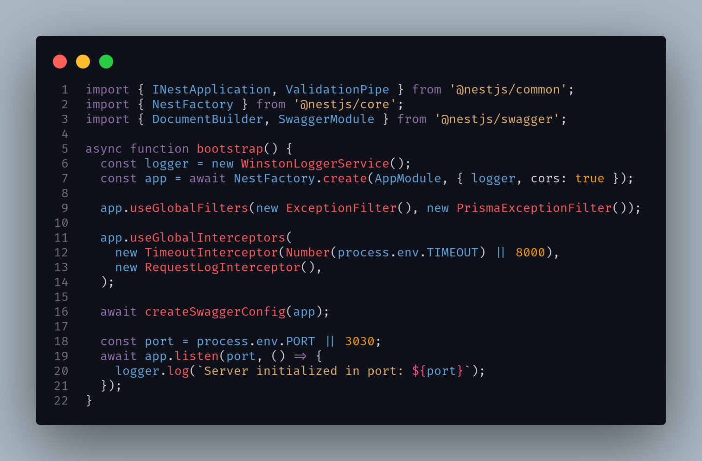

<h1 align="center">
Dionysuz Theme
</h1>

## Nature Theme

## Pastel Theme

## Special thanks

Thanks to [oscarmcm](https://github.com/oscarmcm) for his [ocean-space](https://github.com/oscarmcm/ocean-space) theme, which highly inspired this VS Code port.

## License

[MIT](LICENSE)
